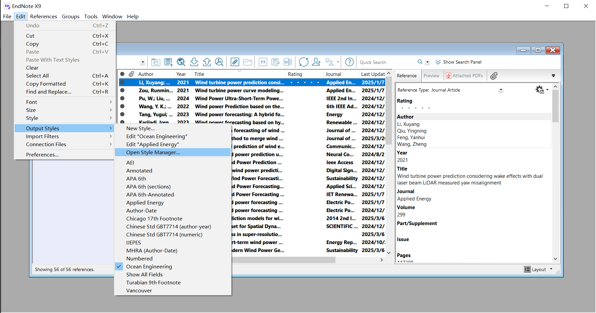
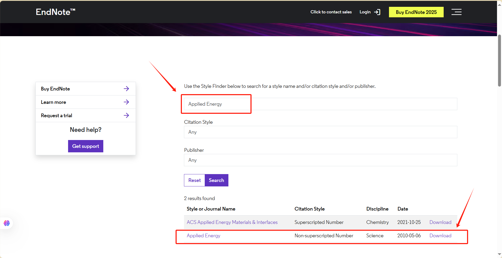
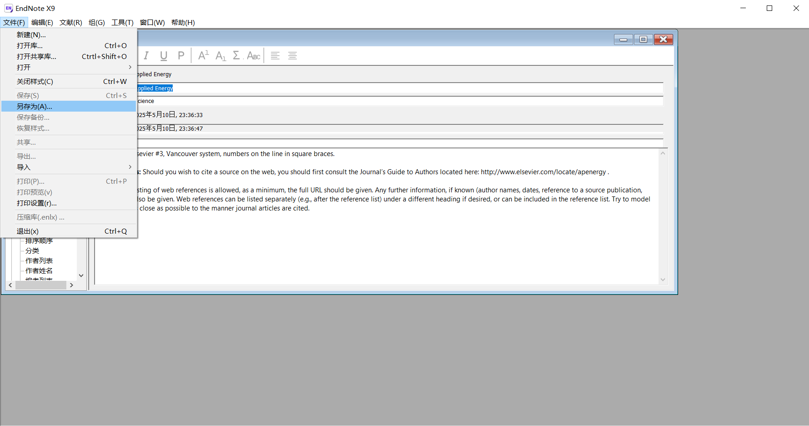
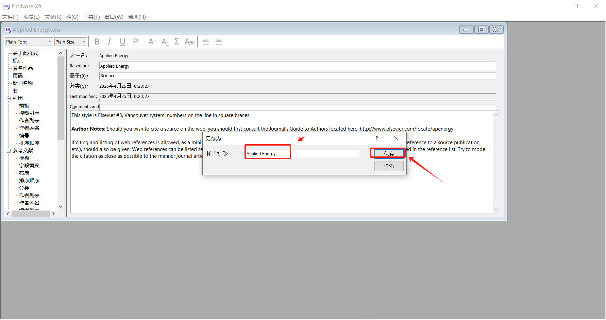
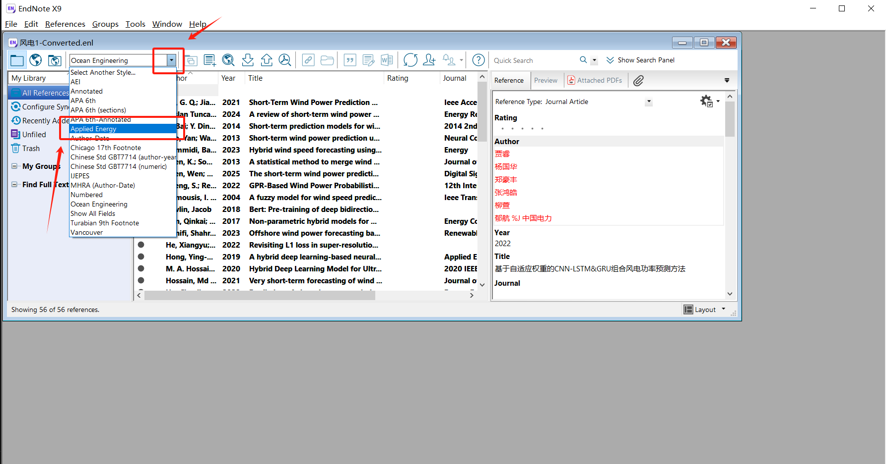

# 【Endnotes使用】output styles下载
对于Endnotes客户端未下载的Output Styles，可以到Endnotes官网搜索下载
打开Endnotes X9，点击Edit->Output Styles->Open Style Manager

点击Get More On the Web进入官网下载界面

输入期刊名称，Search，看搜索结果，Download对应的期刊Styles

下载完成，直接双击打开该.ens文件，自动在Endnotes中打开。
File->Save As，输入名称并保存

回到文献库，已经可以看到导入了新的Styles
